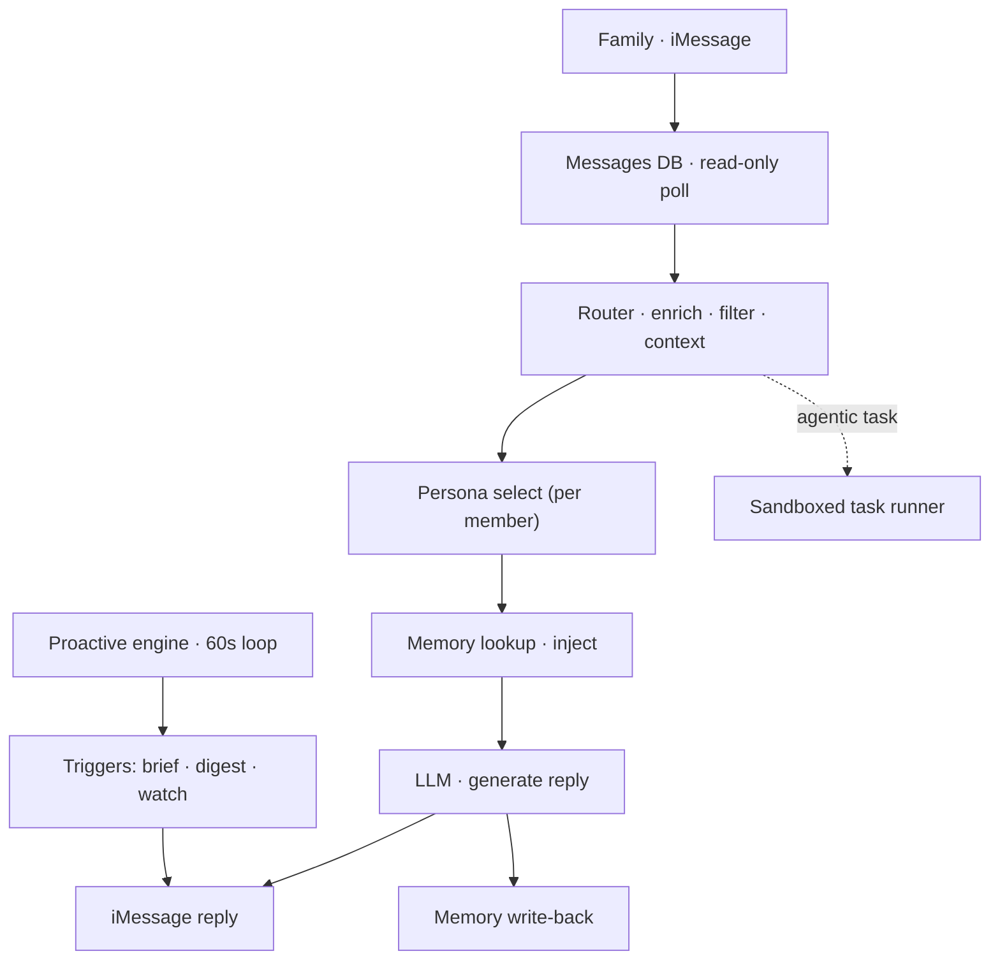
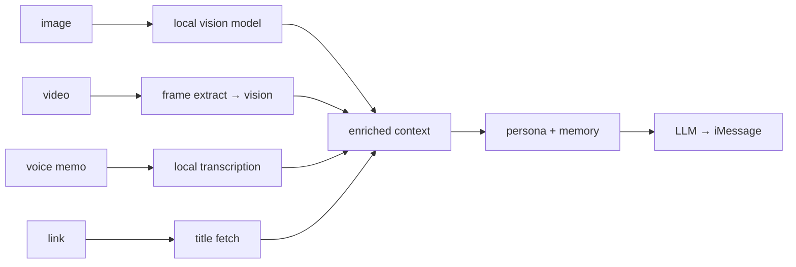

# Candice, a Family AI System

> An always-on, local-first AI system I built for my family. It lives in iMessage,
> keeps a separate long-term memory and persona for each person, and reaches out
> proactively instead of waiting to be asked.
>
> **Live write-up & diagrams → https://evcandice.github.io/candice/**
>
> *The implementation is private. This repo documents the architecture and the
> engineering decisions behind it.*

---

## The idea

Most "AI assistants" are a chat box you have to remember to open. Candice is the opposite: she runs quietly on a Mac at home, reads the family's existing iMessage threads, and is useful **before** anyone asks like a morning brief, a weekly digest, a nudge when something looks off. 
Each family member gets their own private memory and their own version of her personality.

The hard constraint I designed everything around was **privacy**: models, memory, and media processing all run on the home machine. The only thing that leaves the network is the message text sent to a single LLM API.

## Why these choices

Two questions come up whenever I describe Candice: why build her instead of running an off-the-shelf agent and why bury her in iMessage. Both were deliberate.

### Why not a general-purpose agent

Tools like _OpenClaw_ and _Hermes_ are genuinely good but they're general-purpose agents built around a single operator. Candice is built around a *household*, and that one difference drives everything:

- **Privacy is enforced, not configured**. General agents are model-agnostic pipes you point at a provider so their privacy posture is whatever you set up. Candice runs embeddings, fact extraction, transcription and vision on-device with exactly one external call. Reading a family's real message threads demands privacy by architecture not by config flag.
- **Proactive by design**. a general agent waits for you to message it. Candice's scheduling engine reaches out first (e.g. briefs, digests and nudges) behind cooldowns and anti-spam gates so it stays useful instead of becoming noise.
- **Per-person by default**. General agents build one deepening model of *you*. Candice gives every family member an isolated memory namespace; what one person shares never leaks to another. That's multi-tenancy you'd have to bolt on elsewhere.
- **Safe self-maintenance**. Plenty of agents self-improve. Candice self-updates *and* rolls back on any red test, timeout, or conflict, with self-modification fenced away from its own installer, service definitions and safety code. "Self-evolving" is a nice headline; self-evolving without being able to brick the thing my family relies on daily is the actual requirement.

If I wanted a hackable cross-platform agent for myself, I'd reach for one of those. Candice wins only against a narrower, harder spec: private, proactive, multi-person and reliable enough to disappear into the background.

### Why iMessage, not WhatsApp or Telegram

- **The family already lives there.** An ambient butler dies the moment it asks people to install an app or start a chat with a bot. iMessage is where the threads already are, so adoption cost is zero.
- **Local read-only DB access is the enabler.** iMessage persists to a SQLite database on the Mac, which Candice polls read-only; the same machine that does all the enrichment. WhatsApp is end-to-end encrypted with no readable local store; just that, it's owned by Meta. Telegram's bot API is clean, but it routes through Telegram's servers *and* forces people to talk to a bot account instead of their normal threads and also end-to-end encryption is questionable. Both break the two pillars Candice stands on: privacy and ambient presence.
- **It keeps the data path honest.** On-device processing over the local Messages DB matches the hard privacy constraint. The WhatsApp and Telegram paths both push message content through a third party before anything useful happens.

The trade-offs are real and worth naming: iMessage has no official API, so reading the DB and sending replies leans on automation that can be fragile across macOS updates, and the whole approach assumes an Apple-ecosystem household. For most families elsewhere, WhatsApp would be the only realistic channel. For *this* family, on this hardware, iMessage is what makes the architecture clean. It's a deliberate trade of generality for something tighter, more private, and lower-friction.

## Design principles

- **Local-first**: embeddings, fact extraction, transcription, and vision all run on-device via Ollama. One external API call, nothing else.
- **Proactive, not reactive**: a scheduling engine decides when reaching out is worth it, with cooldowns, muting, and anti-spam gates so it never becomes noise.
- **Per-person isolation**: every member has a separate vector-memory namespace; what one person tells Candice never surfaces for another.
- **Self-maintaining**: it updates and tests itself nightly and rolls back on failure, so it stays healthy without me babysitting it.

## System overview

## Message pipeline

Every inbound message is enriched **before** the model ever sees it, all locally:

Photos get described, voice memos transcribed, video frames captioned, links
resolved — so the model receives text-rich context without anything leaving the Mac.

## Memory

Each conversation is distilled into durable facts, preferences, and patterns,
stored per person:

- **Vector store** — Chroma, one namespace per family member
- **Embeddings** — `nomic-embed-text` via Ollama (on-device)
- **Fact extraction** — `qwen3:4b` via Ollama (on-device)
- **Hygiene** — a scheduled audit prunes stale or contradictory memories

## Proactive engine

An asyncio loop evaluates each trigger on a fixed interval and only sends when it
clears a gauntlet of checks — time window, cooldown, per-person mute, and a global
anti-spam interval. Triggers include a per-person morning brief, a weekly digest,
pattern nudges, and home-state anomaly watches.

## Self-update & safety

- **Nightly self-update** — fetch upstream, rebase the instance's own branch, run
  the full test suite under a bounded timeout; **green** ships the new code, **red /
  timeout / conflict** rolls back to the previous version and notifies me. The
  instance can't brick itself.
- **Guarded autonomy** — Candice can take on coding tasks via a sandboxed runner,
  but self-modification is fenced off from the installer, service definitions, and
  its own safety code, enforced by reverting protected-path changes against a
  pre-run checkpoint.
- **Secrets** — live only in the macOS Keychain, retrieved at runtime, never in
  source. A CI gate blocks personal data from ever entering the codebase.

## Tech stack

**Core** Python · FastAPI · uvicorn · asyncio
**AI / LLM** Claude API (conversation) · Ollama (`qwen3:4b`, `llava`, `nomic-embed-text`)
**Memory** mem0 · Chroma · `nomic-embed-text`
**Media** faster-whisper · ffmpeg
**Data** SQLite (WAL) · Apple Messages DB (read-only)
**Dashboard** Next.js 15 · Tailwind · shadcn/ui
**Platform** macOS (Apple Silicon) · launchd · Keychain

---

*Built by [Vhen](https://github.com/techykamatis), 2026 · architecture documented
at [evcandice.github.io/candice](https://evcandice.github.io/candice/).*
