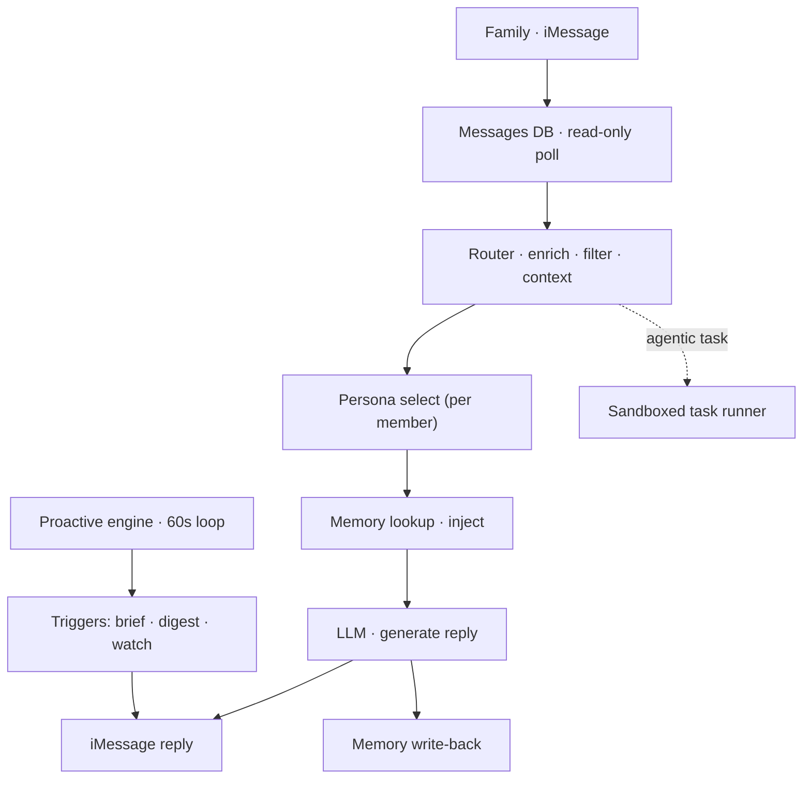
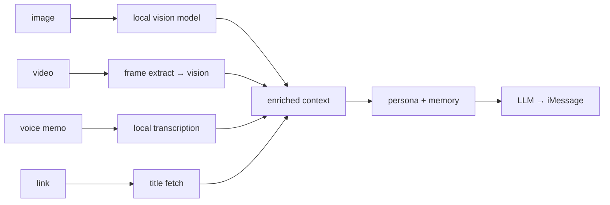

# Candice — a Family AI System

> An always-on, local-first AI butler I built for my family. It lives in iMessage,
> keeps a separate long-term memory and persona for each person, and reaches out
> proactively instead of waiting to be asked.
>
> **Live write-up & diagrams → https://evcandice.github.io/candice/**
>
> *The implementation is private. This repo documents the architecture and the
> engineering decisions behind it.*

---

## The idea

Most "AI assistants" are a chat box you have to remember to open. Candice is the
opposite: she runs quietly on a Mac at home, reads the family's existing iMessage
threads, and is useful **before** anyone asks — a morning brief, a weekly digest,
a nudge when something looks off. Each family member gets their own private memory
and their own version of her personality.

The hard constraint I designed everything around was **privacy**: models, memory,
and media processing all run on the home machine. The only thing that leaves the
network is the message text sent to a single LLM API.

## Design principles

- **Local-first** — embeddings, fact extraction, transcription, and vision all run
  on-device via Ollama. One external API call, nothing else.
- **Proactive, not reactive** — a scheduling engine decides when reaching out is
  worth it, with cooldowns, muting, and anti-spam gates so it never becomes noise.
- **Per-person isolation** — every member has a separate vector-memory namespace;
  what one person tells Candice never surfaces for another.
- **Self-maintaining** — it updates and tests itself nightly and rolls back on
  failure, so it stays healthy without me babysitting it.

## System overview

## Message pipeline

Every inbound message is enriched **before** the model ever sees it, all locally:

Photos get described, voice memos transcribed, video frames captioned, links
resolved — so the model receives text-rich context without anything leaving the Mac.

## Memory

Each conversation is distilled into durable facts, preferences, and patterns,
stored per person:

- **Vector store** — Chroma, one namespace per family member
- **Embeddings** — `nomic-embed-text` via Ollama (on-device)
- **Fact extraction** — `qwen3:4b` via Ollama (on-device)
- **Hygiene** — a scheduled audit prunes stale or contradictory memories

## Proactive engine

An asyncio loop evaluates each trigger on a fixed interval and only sends when it
clears a gauntlet of checks — time window, cooldown, per-person mute, and a global
anti-spam interval. Triggers include a per-person morning brief, a weekly digest,
pattern nudges, and home-state anomaly watches.

## Self-update & safety

- **Nightly self-update** — fetch upstream, rebase the instance's own branch, run
  the full test suite under a bounded timeout; **green** ships the new code, **red /
  timeout / conflict** rolls back to the previous version and notifies me. The
  instance can't brick itself.
- **Guarded autonomy** — Candice can take on coding tasks via a sandboxed runner,
  but self-modification is fenced off from the installer, service definitions, and
  its own safety code, enforced by reverting protected-path changes against a
  pre-run checkpoint.
- **Secrets** — live only in the macOS Keychain, retrieved at runtime, never in
  source. A CI gate blocks personal data from ever entering the codebase.

## Tech stack

**Core** Python · FastAPI · uvicorn · asyncio
**AI / LLM** Claude API (conversation) · Ollama (`qwen3:4b`, `llava`, `nomic-embed-text`)
**Memory** mem0 · Chroma · `nomic-embed-text`
**Media** faster-whisper · ffmpeg
**Data** SQLite (WAL) · Apple Messages DB (read-only)
**Dashboard** Next.js 15 · Tailwind · shadcn/ui
**Platform** macOS (Apple Silicon) · launchd · Keychain

## Why I built it

I wanted to see how far a genuinely *useful* household AI could go when privacy was
a hard requirement rather than a marketing line — everything local, proactive by
design, and reliable enough that my family relies on it daily without thinking about
the machinery underneath.

---

*Built by [Vhen](https://github.com/techykamatis), 2026 · architecture documented
at [evcandice.github.io/candice](https://evcandice.github.io/candice/).*
